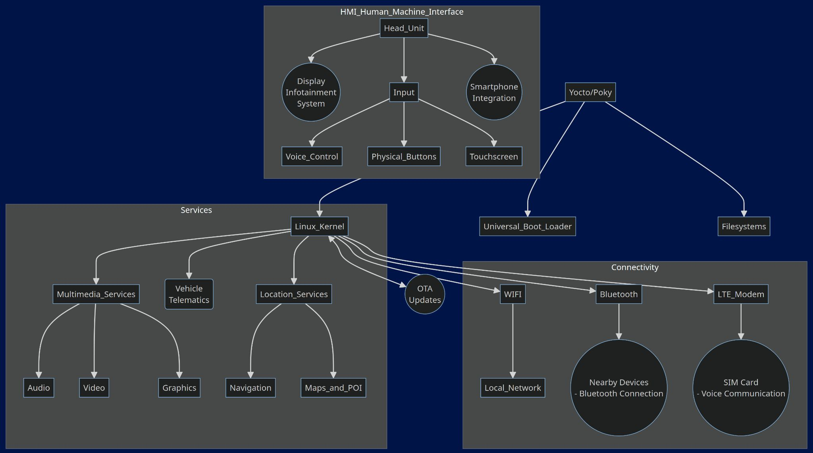
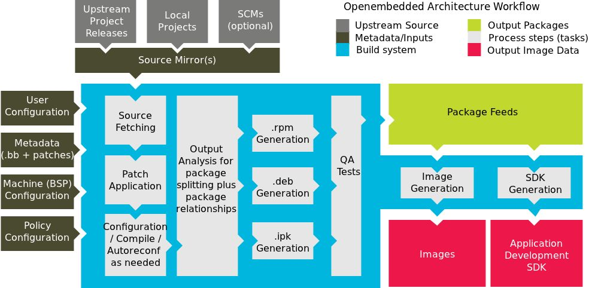
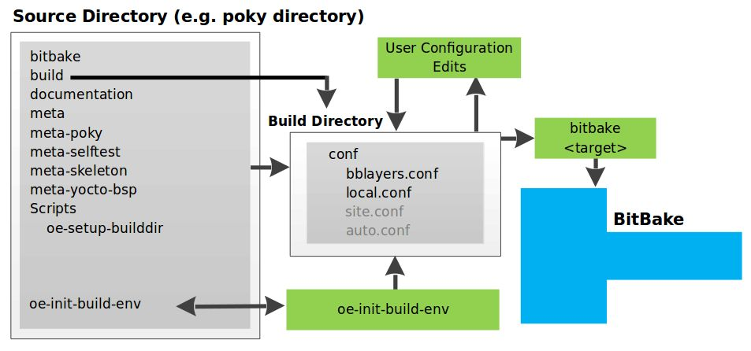
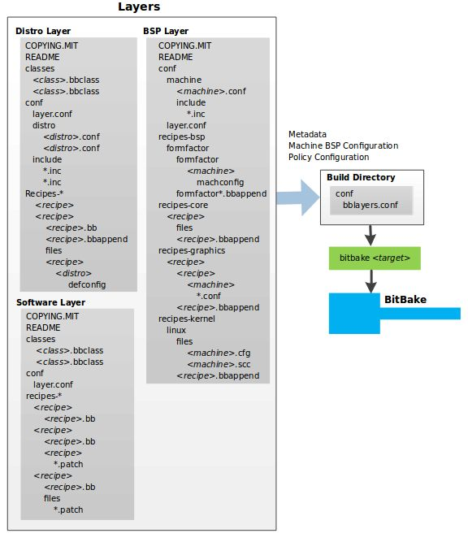
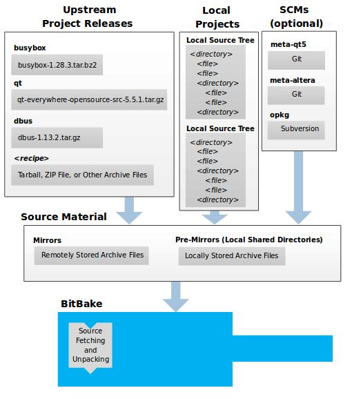
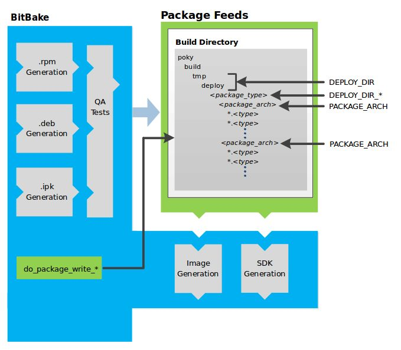
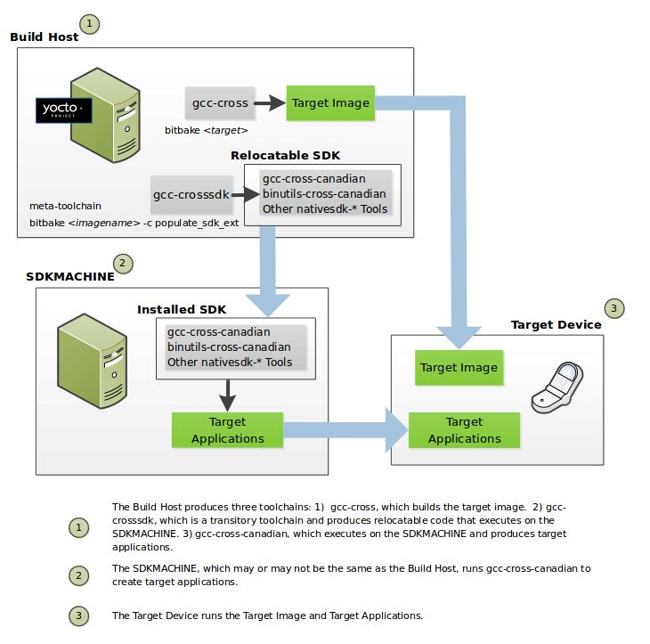

# AGL (Automotive Grade Linux) Based Infotainment System

## Project Presentation

**By**
Anuj Mohite 142103002
Under the Supervision of Prof. Suraj Sawant (COEP Tech)
Industry Mentor: Mr. Chinmay Kulkarni (Syrma SGS)
**Date:** 11th March 2024

---

## 1. Introduction

### Problem Statement

This project focuses on the development of an infotainment system based on AGL (Automotive Grade Linux). The objective is to leverage the open-source Yocto Project for customizing and optimizing embedded Linux systems tailored for automotive applications.

### Motivation

- **Customization and Optimization:** Tailor Linux for specific hardware and use cases.
- **Open Source Collaboration:** Benefit from community-driven improvements and stability.
- **Cost and Time Efficiency:** Reduce development costs and time-to-market.
- **Testing and Validation:** Utilize the robust tools and quality assurance provided by the Yocto Project.

### Scope

The Yocto Project is an open-source collaboration project aimed at developers of embedded Linux systems. It uses the OpenEmbedded project and BitBake tool to construct complete Linux images. The project includes:

- **Poky:** Reference build host.
- **Build Appliance:** For building and booting custom embedded Linux images.

## 2. Objectives

- Set up a Linux build host using the Yocto Project.
- Build Linux images suitable for emulation and actual hardware.
- Understand and utilize Yocto Project core components.
- Highlight the ease of use and customization options provided by Yocto.

## 3. Generalized Implementation of AGL Based on Yocto - Poky Distribution

### Yocto Project Development Environment

#### 1. User Configurations

Define build properties such as target architecture and source storage.

#### 2. Metadata, Machine Configuration, and Policy Configuration

- **Metadata (.bb + Patches):** Software layers with recipe files and patches.
- **Machine BSP Configuration:** Board Support Package layers for machine-specific configurations.
- **Policy Configuration:** Distribution layers providing general policies for images and SDKs.

#### 3. Sources

Access source files through upstream project releases, local projects, and SCMs.

#### 4. Package Feeds

Packages are sourced from a package feed area in the build directory.

## 4. Experimental Setup

- **Build Host:** Minimum of 32GB RAM + 200GB free disk space on a supported Linux distribution (e.g., Fedora, openSUSE, CentOS, Debian, Ubuntu).
- **Build Host Packages:** Necessary packages for the build host.
- **Yocto Project Release:** A release of the Yocto Project.

**Supported Linux Distributions:**
- Ubuntu, Fedora, openSUSE, CentOS, Debian.

**Requirements:**
- Git 1.8.3.1 or greater
- Tar 1.24 or greater
- Python 2.7.3 or greater (excluding Python 3.x)

## 5. Methodology

### Hardware Requirements

- Raspberry Pi 4b
- HDMI Cable with Monitor
- Internet Connection (LAN)
- I/O Devices: Keyboard, Mouse
- Power Supply (5V DC)
- LCD Display (SPI 420x320 Serial Monitor)

### Yocto Project Highlights

- Provides recent Linux kernels and system components.
- Supports various hardware and device emulation through QEMU.
- Layer mechanism for system extension and customization.
- Sato reference User Interface for devices with restricted screen sizes.

## 6. Summary and Future Steps

### Summary

- Open-source collaboration for building custom Linux distributions.
- Key components include Poky, BitBake, and OpenEmbedded-Core.
- Customizable through layers and package recipes.
- Supports various hardware architectures (BSPs).

### Future Steps

- Continuous improvement and hardware support.
- Containerization and cloud integration.
- Enhanced IoT support.
- Embedded AI and machine learning integration.
- Increased community collaboration and adoption.

**Final Build Image:** ~530-750 MB, deployable on Raspberry Pi 4b or QEMU on a host machine.

---

Thank you for your attention!
